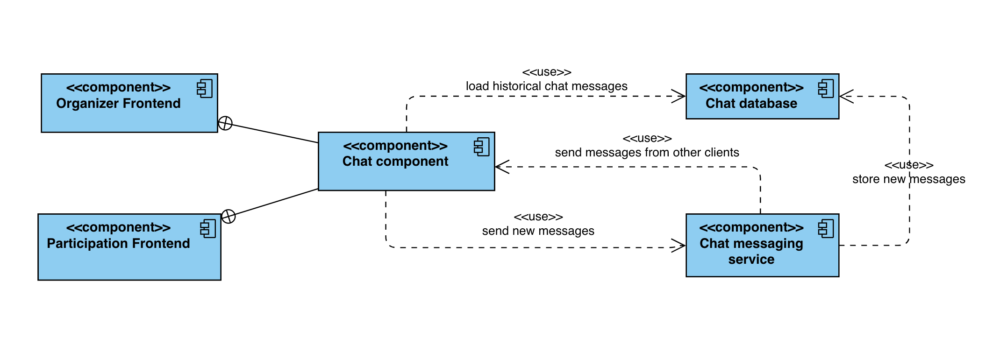
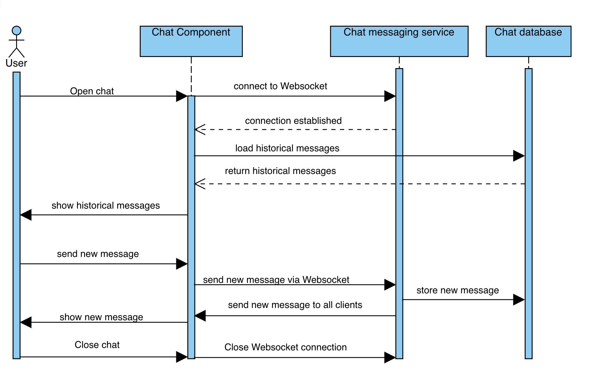
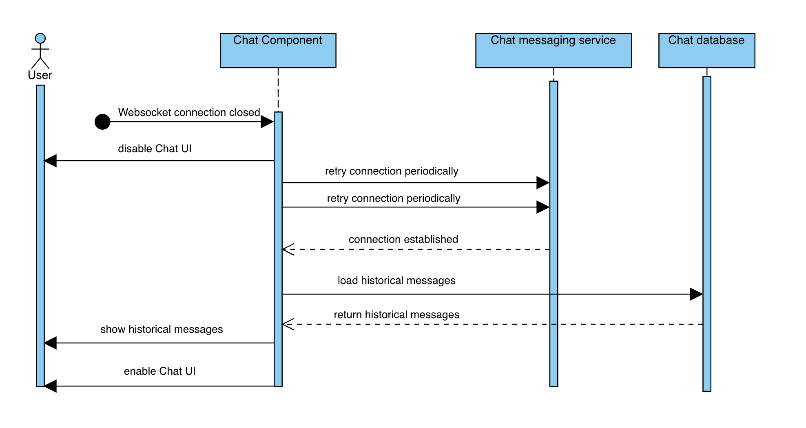

# Architecture

## Objectives

The architecture has to ensure that:

- Users can receive and send messages sent by other users in real-time
- Users can receive messages which has been sent while they were offline (historical messages)
- The chat component can be reused in Organizer and Participation Frontend

## Components

The following components take part in chat messaging.

The **chat component** is a reusable npm package embedded into the organizer and participation frontend.

The **chat database** service persists all chat related entities (e.g. messages) and provides a REST endpoint to manage them.

The **chat messaging service** is responsible to distribute received messages to other clients and the **chat database**.

## Messaging flow

The following execution sequence shows the end-to-end lifecycle of the chat component.

Before the user can start sending messages, all previous messages sent by other users during his/her absence need to be retrieved from the database service.

All newly sent messages will be distributed using a Websocket connection. When the user closes the chat, the websocket connection should be closed.

### Case: Interrupted websocket connection

In order to send messages, the user needs to have a stable websocket connection to the messaging service. The connection can break for multiple reasons like wifi issues, unresponsive servers or troubles with the internet provider.

Thus, the client library used to establish the connection, should notice a broken connection quickly and needs to provide a retry mechanism to establish the connection as soon as possible.

If the client notices a connection loss, the user should not try to send new messages by disabling the chat UI.

After the connection has been reestablished, the UI needs to catch up on missed messages by reloading the historical messages from the database. Afterwards, the UI can be enabled again for the user.

The following sequence diagram illustrates the procedure.

## Risk assessment
